# 🚀 Diagrama Mermaid - Projeto Modernizado Java Spring Boot

## 🏗️ Arquitetura Spring Boot Modernizada

```mermaid
flowchart TD
    %% === CAMADA DE APRESENTAÇÃO ===
    subgraph WebLayer ["🌐 Camada Web (REST API)"]
        subgraph Controllers ["🎮 Controllers"]
            PC["`**ProductController**
            @RestController
            /api/produtos`"]
            
            subgraph Endpoints ["Endpoints REST"]
                GET["`**GET** /api/produtos
                @GetMapping
                List<Product>`"]
                GETID["`**GET** /api/produtos/{id}
                @GetMapping('/{id}')
                Product`"]
                POST["`**POST** /api/produtos
                @PostMapping
                Product`"]
                PUT["`**PUT** /api/produtos/{id}
                @PutMapping('/{id}')
                Product`"]
                DELETE["`**DELETE** /api/produtos/{id}
                @DeleteMapping('/{id}')
                void`"]
            end
        end
        
        subgraph DTOs ["📦 Data Transfer Objects"]
            PDTO["`**ProductDTO**
            - nome: String
            - descricao: String
            - preco: BigDecimal
            - estoque: Integer
            - ativo: Boolean`"]
        end
    end
    
    %% === CAMADA DE NEGÓCIO ===
    subgraph ServiceLayer ["⚙️ Camada de Serviço"]
        PS["`**ProductService**
        @Service
        @Transactional`"]
        
        subgraph ServiceMethods ["Métodos de Negócio"]
            SM1["`**findAll()**
            Lista todos produtos`"]
            SM2["`**findById(Long id)**
            Busca por ID`"]
            SM3["`**save(Product)**
            Salva/Atualiza`"]
            SM4["`**delete(Long id)**
            Remove produto`"]
            SM5["`**findByNome(String)**
            Busca por nome`"]
        end
        
        subgraph BusinessValidations ["🔍 Validações de Negócio"]
            BV1["`**validateProduct()**
            • Nome obrigatório
            • Preço > 0
            • Estoque >= 0`"]
            BV2["`**checkDuplicates()**
            Verifica duplicação`"]
            BV3["`**businessRules()**
            Regras específicas`"]
        end
    end
    
    %% === CAMADA DE PERSISTÊNCIA ===
    subgraph DataLayer ["💾 Camada de Dados"]
        subgraph Repository ["📚 Repository Pattern"]
            PR["`**ProductRepository**
            @Repository
            extends JpaRepository`"]
            
            subgraph RepositoryMethods ["Métodos de Acesso"]
                RM1["`**findAll()**
                List<Product>`"]
                RM2["`**findById(Long)**
                Optional<Product>`"]
                RM3["`**save(Product)**
                Product`"]
                RM4["`**deleteById(Long)**
                void`"]
                RM5["`**findByNomeContaining()**
                List<Product>`"]
                RM6["`**existsByNome(String)**
                boolean`"]
            end
        end
        
        subgraph Entity ["🏷️ Entidade JPA"]
            PENT["`**Product**
            @Entity
            @Table(name='produtos')`"]
            
            subgraph EntityFields ["Campos da Entidade"]
                EF1["`**@Id @GeneratedValue**
                private Long id`"]
                EF2["`**@NotBlank**
                private String nome`"]
                EF3["`**@Column**
                private String descricao`"]
                EF4["`**@Positive**
                private BigDecimal preco`"]
                EF5["`**@PositiveOrZero**
                private Integer estoque`"]
                EF6["`**@Column**
                private Boolean ativo`"]
            end
        end
        
        subgraph Database ["🗄️ H2 Database"]
            H2["`**H2 In-Memory DB**
            - Tabela: produtos
            - Console: /h2-console
            - DDL: create-drop`"]
        end
    end
    
    %% === CONFIGURAÇÃO ===
    subgraph ConfigLayer ["⚙️ Configuração"]
        subgraph SpringBoot ["🍃 Spring Boot"]
            APP["`**Application.java**
            @SpringBootApplication
            main(String[] args)`"]
            
            APPYML["`**application.yml**
            • Server port: 8080
            • H2 configuration
            • JPA settings
            • Logging levels`"]
        end
        
        subgraph Maven ["📦 Maven Dependencies"]
            POM["`**pom.xml**
            • spring-boot-starter-web
            • spring-boot-starter-data-jpa
            • spring-boot-starter-validation
            • h2database`"]
        end
    end
    
    %% === TESTES ===
    subgraph TestLayer ["🧪 Camada de Testes"]
        subgraph UnitTests ["Unit Tests"]
            PST["`**ProductServiceTest**
            @ExtendWith(MockitoExtension)`"]
            PRT["`**ProductRepositoryTest**
            @DataJpaTest`"]
        end
        
        subgraph IntegrationTests ["Integration Tests"]
            PCT["`**ProductControllerTest**
            @WebMvcTest`"]
            PIT["`**ProductIntegrationTest**
            @SpringBootTest`"]
        end
    end
    
    %% === CONEXÕES PRINCIPAIS ===
    
    %% Fluxo Request/Response
    GET --> PC
    GETID --> PC
    POST --> PC
    PUT --> PC
    DELETE --> PC
    
    PC --> PDTO
    PC --> PS
    
    %% Service Layer
    PS --> SM1
    PS --> SM2
    PS --> SM3
    PS --> SM4
    PS --> SM5
    
    PS --> BV1
    PS --> BV2
    PS --> BV3
    
    PS --> PR
    
    %% Repository Layer
    PR --> RM1
    PR --> RM2
    PR --> RM3
    PR --> RM4
    PR --> RM5
    PR --> RM6
    
    PR --> PENT
    PENT --> H2
    
    %% Entity Fields
    PENT --> EF1
    PENT --> EF2
    PENT --> EF3
    PENT --> EF4
    PENT --> EF5
    PENT --> EF6
    
    %% Configuration
    APP --> PS
    APPYML --> H2
    POM --> APP
    
    %% Tests
    PST --> PS
    PRT --> PR
    PCT --> PC
    PIT --> APP
    
    %% === MAPEAMENTO DELPHI → JAVA ===
    subgraph Mapping ["🔄 Mapeamento Delphi → Java"]
        MAP1["`**TProductForm** → **ProductController**
        Formulário → REST Controller`"]
        MAP2["`**QryProdutos** → **ProductRepository**
        Query → JPA Repository`"]
        MAP3["`**btnSalvarClick** → **save()**
        Evento → Service Method`"]
        MAP4["`**DataModule1** → **ProductService**
        DataModule → Service Layer`"]
        MAP5["`**FieldByName('Nome')** → **@NotBlank**
        Validação → Bean Validation`"]
        MAP6["`**ShowMessage()** → **ResponseEntity**
        Message → HTTP Response`"]
    end
    
    %% === ESTILIZAÇÃO ===
    classDef webClass fill:#e3f2fd,stroke:#1976d2,stroke-width:2px
    classDef serviceClass fill:#e8f5e8,stroke:#388e3c,stroke-width:2px
    classDef dataClass fill:#f3e5f5,stroke:#7b1fa2,stroke-width:2px
    classDef configClass fill:#fff3e0,stroke:#f57c00,stroke-width:2px
    classDef testClass fill:#fce4ec,stroke:#c2185b,stroke-width:2px
    classDef mappingClass fill:#f9fbe7,stroke:#689f38,stroke-width:2px
    
    class PC,GET,GETID,POST,PUT,DELETE,PDTO webClass
    class PS,SM1,SM2,SM3,SM4,SM5,BV1,BV2,BV3 serviceClass
    class PR,RM1,RM2,RM3,RM4,RM5,RM6,PENT,EF1,EF2,EF3,EF4,EF5,EF6,H2 dataClass
    class APP,APPYML,POM configClass
    class PST,PRT,PCT,PIT testClass
    class MAP1,MAP2,MAP3,MAP4,MAP5,MAP6 mappingClass
```

## 📋 Características da Modernização

### 🎯 **Arquitetura Spring Boot**
- **Padrão MVC**: Model-View-Controller
- **API REST**: JSON-based communication
- **Dependency Injection**: @Autowired
- **Auto-Configuration**: Spring Boot magic

### 🔧 **Tecnologias Modernas**
- **Java 17**: LTS version
- **Spring Boot 3.2**: Latest stable
- **Spring Data JPA**: ORM abstraction
- **H2 Database**: In-memory for development
- **Maven**: Build automation
- **Bean Validation**: Declarative validation

### 📊 **Melhorias Implementadas**
1. **Separation of Concerns**: Controller → Service → Repository
2. **RESTful Design**: HTTP methods, status codes
3. **Validation**: Annotations, centralized
4. **Testing**: Unit + Integration tests
5. **Configuration**: External, environment-based
6. **Documentation**: Self-documenting API

### 🔄 **Correspondência Funcional**

| **Delphi Original** | **Java Spring Boot** | **Tipo** |
|---------------------|----------------------|----------|
| `TProductForm` | `ProductController` | Interface |
| `QryProdutos.Open` | `repository.findAll()` | Read |
| `QryProdutos.Append` | `service.save(new Product())` | Create |
| `QryProdutos.Post` | `service.save(product)` | Update |
| `QryProdutos.Delete` | `service.delete(id)` | Delete |
| `Nome obrigatório` | `@NotBlank` | Validation |
| `Preço > 0` | `@Positive` | Validation |
| `ShowMessage()` | `ResponseEntity` | Feedback |

### ⚡ **Endpoints da API**

- **GET** `/api/produtos` → Lista todos
- **GET** `/api/produtos/{id}` → Busca por ID  
- **POST** `/api/produtos` → Cria novo
- **PUT** `/api/produtos/{id}` → Atualiza
- **DELETE** `/api/produtos/{id}` → Remove
