# 📊 Diagrama Mermaid - Projeto Original Delphi

## 🏗️ Arquitetura do Sistema Original

```mermaid
flowchart TD
    %% === INTERFACE DO USUÁRIO ===
    subgraph UI ["🖥️ Interface Delphi"]
        PF["`**TProductForm**
        Cadastro de Produtos`"]
        
        subgraph Controls ["Controles de Interface"]
            DBG["`**DBGrid1**
            Grade de Produtos`"]
            DBN["`**DBNavigator1**
            Navegação`"]
            DBE1["`**DBEdit1**
            Nome`"]
            DBE2["`**DBEdit2**
            Descrição`"]
            DBE3["`**DBEdit3**
            Preço`"]
            DBE4["`**DBEdit4**
            Estoque`"]
            DBCB["`**DBCheckBox1**
            Ativo`"]
        end
        
        subgraph Buttons ["Botões CRUD"]
            BN["`**btnNovo**
            Novo Produto`"]
            BS["`**btnSalvar**
            Salvar`"]
            BC["`**btnCancelar**
            Cancelar`"]
            BE["`**btnExcluir**
            Excluir`"]
        end
    end
    
    %% === CAMADA DE DADOS ===
    subgraph DataLayer ["💾 Camada de Dados"]
        DS["`**DataSource1**
        Fonte de Dados`"]
        
        subgraph DM ["📂 DataModule1"]
            QP["`**QryProdutos**
            Query de Produtos`"]
        end
        
        subgraph DB ["🗄️ Banco de Dados"]
            TB["`**Tabela Produtos**
            - ID (PK)
            - Nome (NOT NULL)
            - Descrição
            - Preco (> 0)
            - Estoque (DEFAULT 0)
            - Ativo (DEFAULT TRUE)`"]
        end
    end
    
    %% === LÓGICA DE NEGÓCIO ===
    subgraph BusinessLogic ["⚙️ Lógica de Negócio"]
        subgraph Events ["Eventos do Formulário"]
            FC["`**FormCreate**
            Inicialização`"]
            FS["`**FormShow**
            Carregamento`"]
        end
        
        subgraph CrudOps ["Operações CRUD"]
            CREATE["`**btnNovoClick**
            • QryProdutos.Append
            • Valores padrão
            • Foco no nome`"]
            
            UPDATE["`**btnSalvarClick**
            • Validar nome
            • Validar preço > 0
            • QryProdutos.Post`"]
            
            DELETE["`**btnExcluirClick**
            • Confirmar exclusão
            • QryProdutos.Delete`"]
            
            CANCEL["`**btnCancelarClick**
            • QryProdutos.Cancel`"]
        end
        
        subgraph Validations ["🔍 Validações"]
            V1["`**Nome Obrigatório**
            IF Nome = '' THEN
            ShowMessage('Nome obrigatório!')`"]
            
            V2["`**Preço Positivo**
            IF Preco <= 0 THEN
            ShowMessage('Preço > zero!')`"]
            
            V3["`**Confirmação**
            MessageDlg('Confirma exclusão?')`"]
        end
    end
    
    %% === CONEXÕES PRINCIPAIS ===
    PF --> DS
    DS --> QP
    QP --> TB
    
    %% === CONTROLES → DATASOURCE ===
    DBG --> DS
    DBN --> DS
    DBE1 --> DS
    DBE2 --> DS
    DBE3 --> DS
    DBE4 --> DS
    DBCB --> DS
    
    %% === BOTÕES → OPERAÇÕES ===
    BN --> CREATE
    BS --> UPDATE
    BC --> CANCEL
    BE --> DELETE
    
    %% === VALIDAÇÕES ===
    UPDATE --> V1
    UPDATE --> V2
    DELETE --> V3
    
    %% === EVENTOS ===
    PF --> FC
    PF --> FS
    FC --> DS
    FS --> QP
    
    %% === FLUXO SQL ===
    FS --> |"SQL: SELECT * FROM Produtos ORDER BY Nome"| QP
    CREATE --> |"QryProdutos.Append"| QP
    UPDATE --> |"QryProdutos.Post"| QP
    DELETE --> |"QryProdutos.Delete"| QP
    CANCEL --> |"QryProdutos.Cancel"| QP
    
    %% === ESTILIZAÇÃO ===
    classDef formClass fill:#e1f5fe,stroke:#0277bd,stroke-width:2px
    classDef dataClass fill:#f3e5f5,stroke:#7b1fa2,stroke-width:2px
    classDef businessClass fill:#e8f5e8,stroke:#388e3c,stroke-width:2px
    classDef validationClass fill:#fff3e0,stroke:#f57c00,stroke-width:2px
    classDef buttonClass fill:#fce4ec,stroke:#c2185b,stroke-width:2px
    
    class PF,DBG,DBN,DBE1,DBE2,DBE3,DBE4,DBCB formClass
    class DS,QP,TB,DM dataClass
    class FC,FS,CREATE,UPDATE,DELETE,CANCEL businessClass
    class V1,V2,V3 validationClass
    class BN,BS,BC,BE buttonClass
```

## 📋 Detalhes do Sistema

### 🔧 **Tecnologias Utilizadas**
- **Linguagem**: Object Pascal (Delphi)
- **Framework**: VCL (Visual Component Library)
- **Acesso a Dados**: FireDAC/BDE
- **Banco**: SQL Database
- **Arquitetura**: Forms + DataModule

### 📊 **Entidades Identificadas**
- **Produto**: Entidade principal com campos específicos
- **Operações**: CRUD completo implementado
- **Validações**: Nome obrigatório e Preço positivo

### 🔄 **Fluxo de Dados**
1. **Inicialização**: FormCreate → DataSource → Query
2. **Carregamento**: FormShow → SQL Query → Grid
3. **Operações CRUD**: Botões → Validações → Database
4. **Feedback**: Messages → Usuario

### ⚡ **Eventos Principais**
- `FormCreate`: Configura DataSource
- `FormShow`: Carrega dados com SQL
- `btnNovoClick`: Novo registro com valores padrão
- `btnSalvarClick`: Validações + Persistência
- `btnExcluirClick`: Confirmação + Exclusão
- `btnCancelarClick`: Cancelar operação
