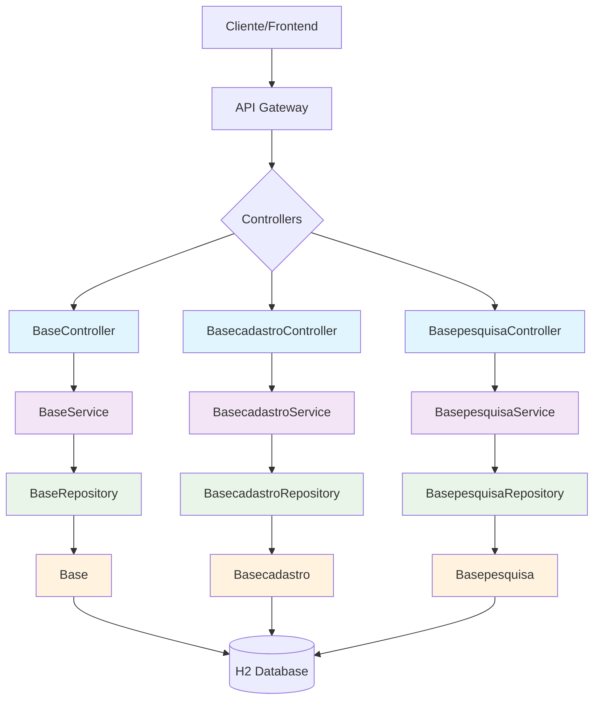

# 🏗️ Arquitetura do Sistema - ProjetoModernizadoModern

## Visão Geral

Este documento descreve a arquitetura do sistema modernizado **ProjetoModernizadoModern**, convertido de Delphi para Java Spring Boot.

## 📐 Diagrama de Arquitetura



## 🏛️ Padrões Arquiteturais

### 1. **Arquitetura em Camadas (Layered Architecture)**

O sistema segue o padrão de arquitetura em camadas do Spring Boot:

- **Camada de Apresentação (Controllers):** 5 endpoints REST
- **Camada de Negócio (Services):** 5 services de domínio
- **Camada de Dados (Repositories):** 5 repositórios JPA
- **Camada de Persistência (Entities):** 5 entidades de domínio

### 2. **Injeção de Dependência**
Utiliza o container IoC do Spring para gerenciar dependências.

### 3. **Repository Pattern**
Abstração da camada de dados através de interfaces JPA Repository.

### 4. **REST API**
Endpoints RESTful para comunicação cliente-servidor.

## 📦 Estrutura de Pacotes

```
src/main/java/com/empresa/sistema/
├── entity/          # Entidades JPA (5 classes)
├── repository/      # Repositórios (5 interfaces)
├── service/         # Services de negócio (5 classes)
├── controller/      # Controllers REST (5 classes)
└── Application.java # Classe principal
```

## 🔄 Fluxo de Dados

1. **Client** → REST Request → **Controller**
2. **Controller** → Business Logic → **Service**
3. **Service** → Data Access → **Repository**
4. **Repository** → Database → **Entity**
5. **Entity** → **Repository** → **Service** → **Controller** → **Client**

## 📊 Componentes do Sistema

### Entidades

**Entidades JPA:**
- `Base.java`
- `Basecadastro.java`
- `Basepesquisa.java`
- `Close.java`
- `Show.java`


### Services

**Services de Negócio:**
- `BaseService.java`
- `BasecadastroService.java`
- `BasepesquisaService.java`
- `CloseService.java`
- `ShowService.java`


### Controllers

**Controllers REST:**
- `BaseController.java`
- `BasecadastroController.java`
- `BasepesquisaController.java`
- `CloseController.java`
- `ShowController.java`


## 🛡️ Segurança

- Configuração básica do Spring Security (pode ser expandida)
- Validação de dados com Bean Validation
- CORS habilitado para desenvolvimento

## 📈 Escalabilidade

- Arquitetura stateless permite escalabilidade horizontal
- Pool de conexões configurável
- Cache de primeiro nível do Hibernate

---
*Gerado automaticamente pelo JUNIM*
