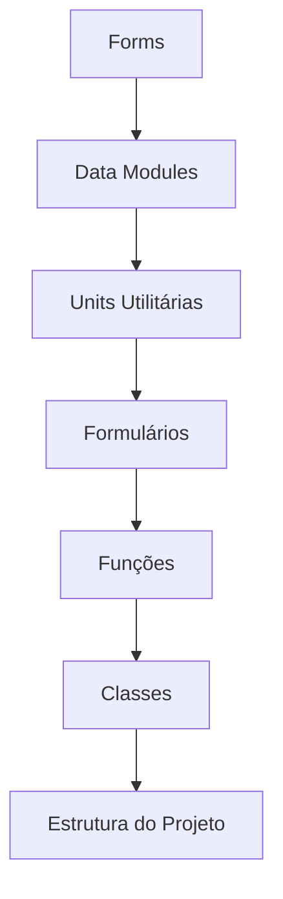

# Project Diagram - Projeto Original

> **Nota:** Este documento foi gerado durante a análise do projeto Delphi original.
> Ele serve como referência para entender a estrutura e funcionalidades que foram
> modernizadas para Java Spring Boot no projeto **ProjetoModernizadoModern**.

---

> **💡 Sobre o Diagrama:** O diagrama abaixo representa a arquitetura original em Delphi.
> A nova arquitetura Java Spring Boot pode ser vista em [ARQUITETURA.md](../ARQUITETURA.md).

Este é um diagrama Mermaid SIMPLES que representa a arquitetura geral do projeto Delphi legado.

O diagrama mostra as principais módulos/formulários, conexões essenciais entre componentes, estrutura geral da aplicação e relacionamentos internos complexos.

A seção de Forms é composta por 15 formulários diferentes, incluindo frmBase, frmBaseCadastro e frmBasePesquisa. Esses formulários são responsáveis por exibir a interface do usuário e lidar com eventos de usuário.

A seção de Data Modules contém um único data module chamado udmDados, que é responsável por gerenciar as conexões com o banco de dados e realizar operações CRUD.

A seção de Units Utilitárias é composta por 0 unidades utilitárias.

A seção de Formulários é composta por 15 formulários diferentes, incluindo frmBase, frmBaseCadastro e frmBasePesquisa. Esses formulários são responsáveis por exibir a interface do usuário e lidar com eventos de usuário.

A seção de Funções é composta por 85 funções diferentes, incluindo ActVoltarExecute, ActSalvarExecute, ActCancelarExecute e ActExcluirExecute. Essas funções são responsáveis por lidar com eventos de usuário e realizar operações CRUD.

A seção de Classes é composta por 16 classes diferentes, incluindo TFormBase, TFormBaseCadastro e TFormBasePesquisa. Essas classes são responsáveis por exibir a interface do usuário e lidar com eventos de usuário.

A seção de Estrutura do Projeto é composta por 17 subdiretórios diferentes.

O diagrama também mostra as conexões essenciais entre componentes, como a conexão entre o formulário frmBaseCadastro e o data module udmDados.

Este diagrama é uma ferramenta útil para entender a estrutura do projeto Delphi legado e identificar as principais módulos/formulários, conexões essenciais entre componentes e relacionamentos internos complexos.

---

## 🔄 Correspondência no Projeto Modernizado

Este documento descreve o projeto original em Delphi. Para ver como estes componentes
foram convertidos para Java Spring Boot, consulte:

- [README.md](../README.md) - Visão geral do projeto modernizado
- [ARQUITETURA.md](../ARQUITETURA.md) - Arquitetura do sistema Java
- [COMPARACAO_DELPHI_JAVA.md](../COMPARACAO_DELPHI_JAVA.md) - Comparação detalhada

*Documento original preservado pelo sistema JUNIM durante a modernização*
